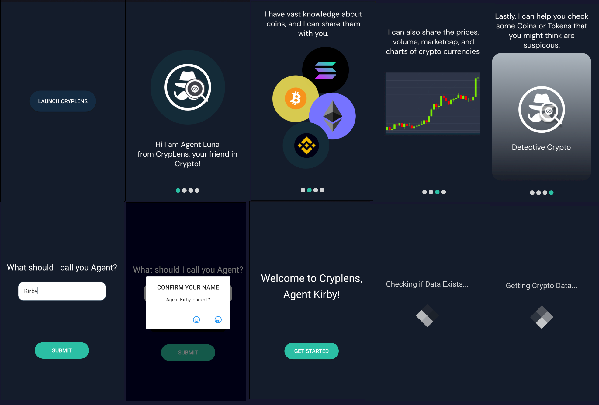
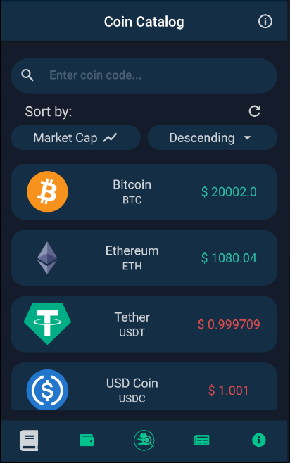
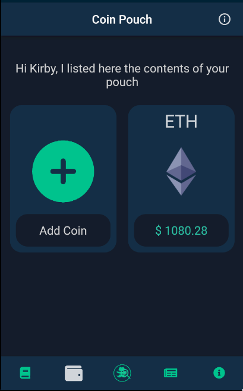
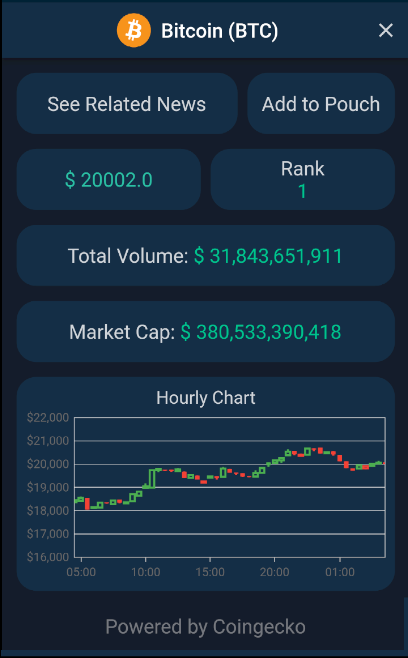
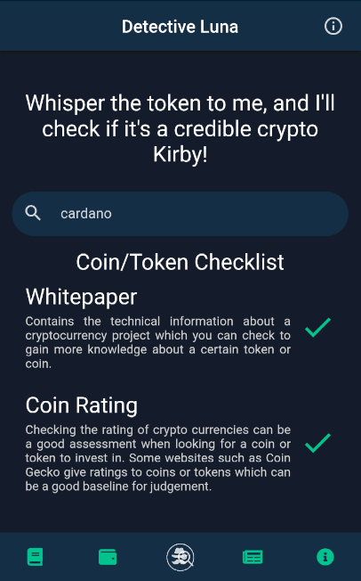
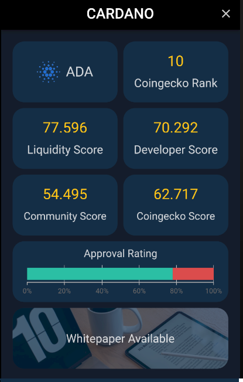
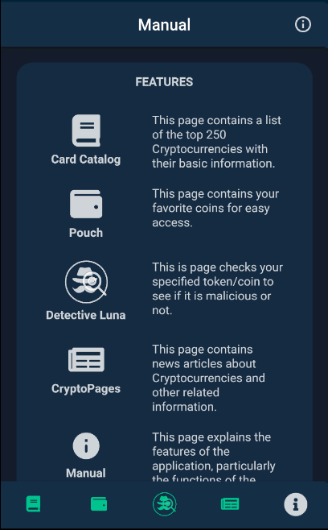

# Cryplens

Cryplens, your mobile crypto detective. 

A collaborative final academic project for the course of Mobile Application development, that aims to utilize flutter in creating an application that can help users navigate their way through the basics of cryptocurrency trading.

## Cryplens Startup

## Catalog Page

## Coins Page

## Lens Page

## News Page

## About Page

